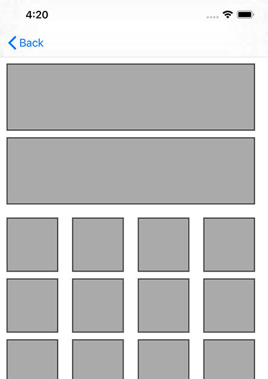

# TMCollectionViewTemplate

计算自动布局的 UICollectionViewCell size，内部处理 size 缓存。

## Requirements

iOS 8.0

## Installation

TMCollectionViewTemplate is available through [CocoaPods](https://cocoapods.org). To install
it, simply add the following line to your Podfile:

```ruby
pod 'TMCollectionViewTemplate', '~> 1.0'
```

## Usage

``` Objective-C
#import <TMCollectionViewTemplate/TMCollectionViewTemplate.h>


- (CGSize)collectionView:(UICollectionView *)collectionView layout:(UICollectionViewLayout *)collectionViewLayout sizeForItemAtIndexPath:(NSIndexPath *)indexPath
{
    if (indexPath.section == 0) {
        return [collectionView tm_heightForCellWithIdentifier:CollectionViewRowCell.reuseIdentifier
            indexPath:indexPath
              maxSize:CollectionViewRowCell.maxCellSize
        configuration:^(CollectionViewIconCell *cell){

        }];
    } else {
        return [collectionView tm_heightForCellWithIdentifier:CollectionViewIconCell.reuseIdentifier
            indexPath:indexPath
              maxSize:CollectionViewIconCell.maxCellSize
        configuration:^(CollectionViewIconCell *cell){

        }];
    }
}
```

效果预览：



## Author

lxb_0605@qq.com

## License

TMCollectionViewTemplate is available under the MIT license. See the [LICENSE](LICENSE) file for more info.
